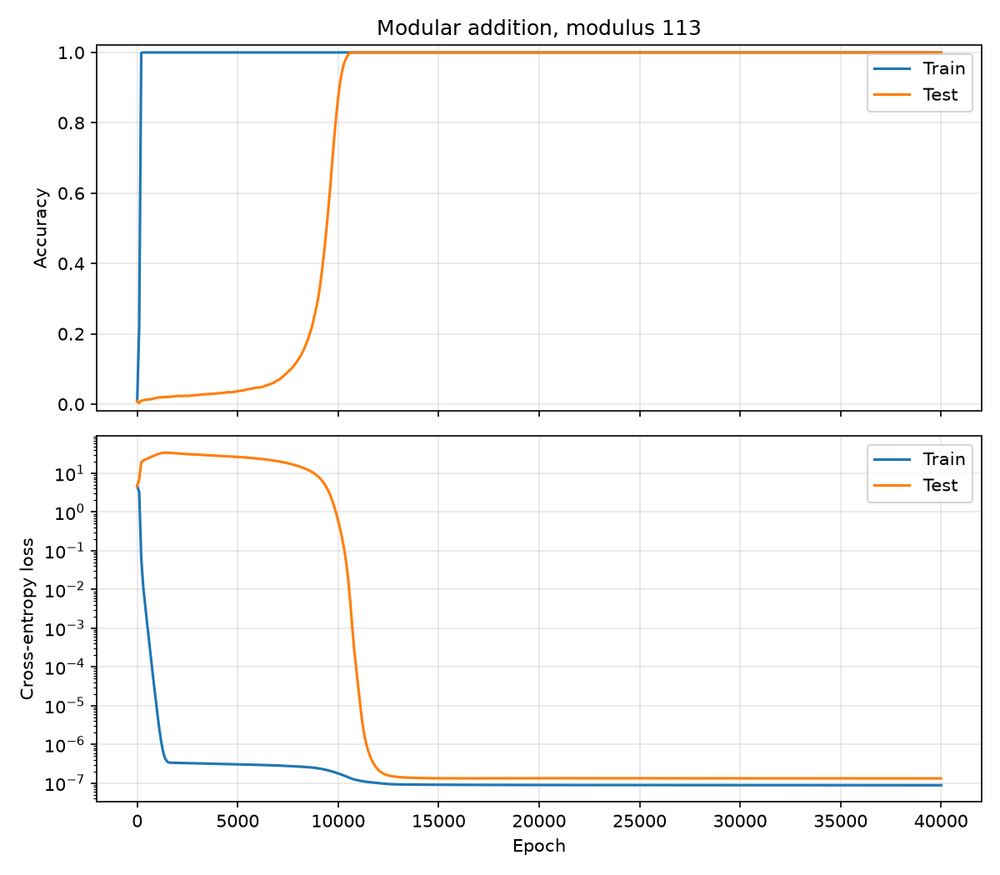
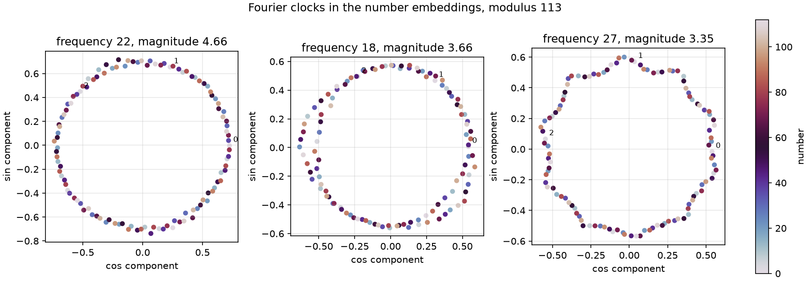
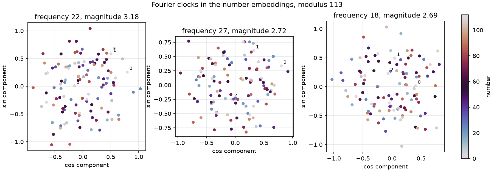
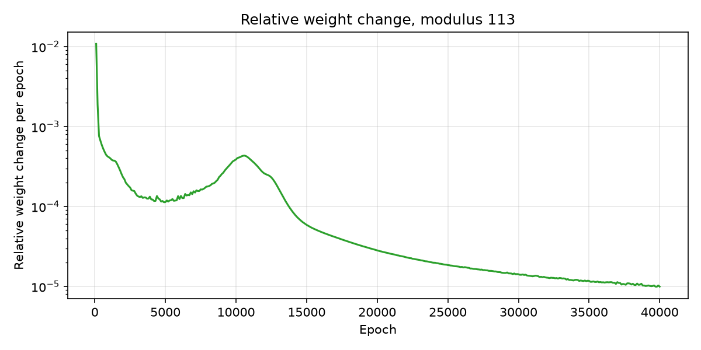

# Grokking modular addition

A small, self-contained reproduction of **grokking**, following the modular-addition experiment from the paper *Progress Measures for Grokking via Mechanistic Interpretability* by Nanda et al. arXiv:2301.05217. [PDF](papers/nanda-2023-progress-measures-for-grokking.pdf) | [arXiv](https://arxiv.org/abs/2301.05217).

## Contents

- [What is grokking?](#what-is-grokking)
- [Experiment](#experiment)
- [What the model learns: clocks](#what-the-model-learns-clocks)
- [Model](#model)
- [Results](#results)
- [Repository layout](#repository-layout)
- [Run it](#run-it)
- [Weight movement during the plateau](#weight-movement-during-the-plateau)
- [Papers and origin](#papers-and-origin)

## What is grokking?

The term is unrelated to xAI's Grok product, though both names trace back to the 1961 novel *Stranger in a Strange Land*, where the Martian word *grok* means to understand something so deeply and completely that it becomes intuitive.

In machine learning, **grokking** is an unexpected phenomenon of delayed generalization after overfitting. A model can completely overfit, memorizing its training data while performing terribly on unseen examples. Yet, with further training, test performance can suddenly improve long after the training metrics appear to have converged.

In this example, the model first memorizes 30% of the modular-addition table while remaining near chance level on the other 70%. Thousands of full-batch updates later, test accuracy rises abruptly even though training accuracy and training loss had been flat for a long time. As we shall see, the model gradually develops a generalizing clock-based circuit during this plateau.



## Experiment

For a given prime $p$ and two smaller integers $a$ and $b$, we input into the model

$$
[a,\ b,\ =]
$$

and the target is

$$
c=(a+b)\bmod p.
$$

Following the paper, we pick $p=113$, for which there are $113^2=12{,}769$ possible pairs. A fixed random 30% subset, 3,830 pairs, is used for training. The remaining 8,939 pairs form the test set.

## What the model learns: clocks

After memorizing the training set, part of the network keeps developing a general solution based on "clocks." Imagine a clock with 113 markers instead of 12 hours. Starting at zero, moving forward by $a$ markers and then by $b$ lands at $(a+b)\bmod 113$. The wraparound is handled naturally by the circle, turning modular addition into ordinary addition of angles.

Technically speaking, the network learns to organize its number embeddings into discrete Fourier modes. At frequency $k$, number $n$ has phase

$$
\phi_k(n)=\frac{2\pi k~n}{p}.
$$

Projecting the embedding of each number onto the learned cosine and sine directions gives approximately

$$
\left(\cos~\phi_k(n),\ \sin~\phi_k(n)\right).
$$

As $n$ runs from 0 to 112, these points trace a circle. The representation is computationally useful because addition becomes phase addition:

$$
\phi_k(a+b)=\phi_k(a)+\phi_k(b)\pmod{2\pi}.
$$

The transformer can combine the sine and cosine components using the identities

$$
\cos(x+y)=\cos(x)\cos(y)-\sin(x)\sin(y),
$$

$$
\sin(x+y)=\sin(x)\cos(y)+\cos(x)\sin(y).
$$

For a candidate answer $c$, a term such as

$$
\cos\left(\frac{2\pi k(a+b-c)}{p}\right)
$$

is maximal when $c=a+b\pmod p$. The unembedding assigns a high score to candidate answers $c$ whose clock phase matches the phase computed for $a+b$.

The Fourier transform decomposes the sequence of 113 number embeddings into waves. Frequency $k$ is the wave that completes $k$ full cycles as $n$ runs from 0 to 112. Increasing $n$ by one produces the phase change

$$
\Delta\phi_k
=\phi_k(n+1)-\phi_k(n)
=\frac{2\pi k}{113}
\quad\Longleftrightarrow\quad
k\text{ markers per step}.
$$

Frequency 1 advances one marker, frequency 2 advances two, and so on. Because 113 is prime, every frequency that is nonzero modulo 113 visits all 113 positions exactly once before returning to the start. For example, frequency 2 visits $0,2,4,\ldots,112,1,3,\ldots,111$. Frequencies $k$ and $113-k$ trace the same clock in opposite directions, so a real discrete Fourier transform (rfft) contains only 56 unique nonzero frequencies. Each one can represent the complete addition rule.

In fact, the network usually selects a sparse handful of these valid clocks and combines their votes to sharpen the correct output! The paper's mainline model used five key frequencies, $k\in\{14,35,41,42,52\}$, while its other seeds selected different sets of three or four. Our GPU embedding is strongest at 22, 18, and 27; our CPU embedding is strongest at 36, 10, and 9. As a side note, we identify frequencies slightly differently from the paper: we pick the three largest modes in the input embedding, whereas the paper defined a frequency as "key" only when it was also used downstream in the neuron-logit map.

Here is how our clock works for the GPU run:



You can also see that no clear internal clock had formed by epoch 5,000, long after training accuracy saturated at epoch 200. The projected embeddings are still diffuse rather than circular, showing that memorization came first and the generalizing Fourier structure developed later during the plateau:



Note that different frequencies are possible even with the same nominal seeds. A seed fixes a pseudorandom stream inside one implementation, but it does not guarantee identical initial tensors across different code, random-draw order, PyTorch versions, or hardware kernels. A deterministic rerun using identical code, software, hardware, and seeds should reproduce the same frequencies.

## Model

The setup follows Nanda et al.:

- One transformer block
- Model dimension 128
- Four attention heads of dimension 32
- ReLU MLP with hidden dimension 512
- No layer normalization
- Untied token embedding and unembedding
- Full-batch AdamW
- Learning rate $10^{-3}$
- Weight decay 1
- Adam betas $(0.9, 0.98)$
- Model seed 999 and data seed 598
- 40,000 epochs

The model has 227,200 trainable parameters. For perspective:

| Model | Parameters | Size relative to this model |
| --- | ---: | ---: |
| LeNet-5 for MNIST | about 60,000 | 0.26x |
| This modular-addition transformer | 227,200 | 1x |
| GPT-2 small checkpoint | 124,439,808 | about 548x |
| GPT-2 XL | about 1.5 billion | about 6,600x |

The experiment is tiny by modern transformer standards, but already larger than the classic LeNet-5 image classifier.

## Results

We successfully reproduced the result with 40,000-epoch CPU and GPU runs.

| Run | Hardware | Time | Train 99% | Test 99% | Mean plateau movement | Final test |
| --- | --- | ---: | ---: | ---: | ---: | ---: |
| CPU | Intel Core Ultra 9 275HX, 12 threads | 1,787.1 s | epoch 200 | epoch 28,400 | $1.23\times10^{-4}$ | 100% |
| GPU | NVIDIA RTX 5090 Laptop GPU | 109.7 s | epoch 200 | epoch 10,500 | $2.30\times10^{-4}$ | 100% |

The plateau mean uses logged epochs where training accuracy is at least 99% and test accuracy is below 10%.

The GPU run was about 16 times faster. GPU arithmetic does not reproduce the exact sequence of CPU roundings, so the optimization trajectories and grokking epochs differ despite matching seeds and data. This sensitivity is expected for a delayed phase transition.

## Repository layout

```text
.
├── analysis.py       # Weight movement and Fourier projections
├── data.py           # Complete modular-addition table and fixed split
├── main.py           # Experiment setup and output generation
├── model.py          # One-layer transformer
├── plot.py           # Training, weight-change, and Fourier-clock plots
├── report.py         # Run summaries and readable statistics
├── train.py          # Full-batch training loop and measurements
├── requirements.txt
├── papers/
│   ├── power-2022-grokking.pdf
│   └── nanda-2023-progress-measures-for-grokking.pdf
└── runs/
    ├── cpu/
    └── gpu/
```

Each run directory ([`runs/cpu`](runs/cpu) and [`runs/gpu`](runs/gpu)) contains:

- `training.png`: accuracy and cross-entropy
- `weight-change.png`: relative weight change per logged optimizer step
- `clock-epoch-5000.png`: dominant embedding clocks early in the plateau
- `clock.png`: dominant Fourier modes in the learned number embeddings
- `metrics.csv`: measurements every 100 epochs
- `summary.json`: machine-readable run summary
- `stats.txt`: readable hardware, timing, and result summary

## Run it

Create an environment and install the dependencies:

```bash
python -m venv .venv
source .venv/bin/activate
pip install -r requirements.txt
```

GPU:

```bash
python main.py --device cuda --output-dir runs/gpu
```

CPU:

```bash
python main.py --device cpu --cpu-threads 12 --output-dir runs/cpu
```

The GPU command requires a CUDA-enabled PyTorch build (see [PyTorch installation guide](https://pytorch.org/get-started/locally/)).

The defaults reproduce the 40,000-epoch experiment. For a quick test to check the code works add `--epochs 300`.

## Weight movement during the plateau

The conclusion is that flat training metrics do not imply that training has stopped changing the model. To keep track of this, we look at the internal parameter movement of the network, $\theta_t$ after optimizer step $t$, and plot the relative L2 displacement from one optimizer step, defined as:

$$
\rho_t=
\frac{
\left\lVert\theta_t-\theta_{t-1}\right\rVert
}{
\left\lVert\theta_{t-1}\right\rVert
}.
$$

The plot below samples this one-step quantity every 100 epochs. The GPU curve is shown here:



During the middle period, after memorization and before grokking, movement is $O(10^{-4})$ per epoch in both runs. For comparison, decoupled weight decay from the AdamW optimizer alone has the per-step relative scale

$$
\eta\lambda = 10^{-3}\times 1 = 10^{-3}.
$$

Both runs later settle at a few times $10^{-5}$ per epoch. Over thousands of epochs, the middle-period updates substantially restructure the model while training accuracy remains at 100%.

This reveals an interesting open measurement problem: could we know that $10^{-4}$ is "large enough" to expect grokking? Can a task-agnostic metric, similar to weight movement, determine whether relevant internal processing is still developing at a scale that could precede grokking? Such a metric should avoid test labels and should not assume in advance that the solution is Fourier-based. The global L2 movement is evidence that hidden work continues, but it does not by itself distinguish useful circuit formation from decay, symmetry motion, or other quiet drifts.

## Papers and origin

- I first heard about grokking through [The AI That Learned to Understand Long After It Stopped Trying](https://towardsdatascience.com/the-ai-that-learned-to-understand-long-after-it-stopped-trying).
- There is also this relevant prior paper on the subject: Alethea Power, Yuri Burda, Harri Edwards, Igor Babuschkin, and Vedant Misra. *Grokking: Generalization Beyond Overfitting on Small Algorithmic Datasets*. arXiv:2201.02177, 2022. [PDF](papers/power-2022-grokking.pdf) | [arXiv](https://arxiv.org/abs/2201.02177)

